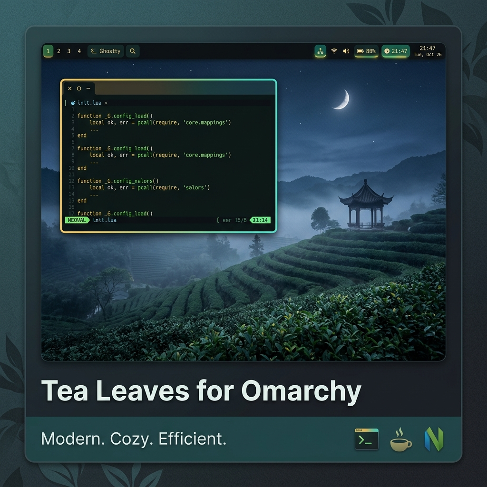

# Tea Leaves Theme for Omarchy

A beautiful nighttime theme for [Omarchy](https://omarchy.org/) inspired by the [Tea Leaves](https://github.com/DasLanky/tea-leaves) VSCode extension. Cozy charcoal-teal backgrounds, warm gold-to-teal gradient borders, and a nature/tea inspired color palette make for a calming, comfortable desktop.


*Hyprland with gradient borders, Waybar, Ghostty terminal, and Neovim.*

## Color Palette

| Role | Hex |
|------|-----|
| Background | `#1b1f20` |
| Foreground | `#d4d4d4` |
| Teal (accent) | `#2d8f6d` |
| Gold (accent) | `#e5c185` |
| Sage Green | `#92ba92` |
| Muted Blue | `#408da1` |
| Muted Cyan | `#4daaaa` |
| Orange / Red | `#d8866a` |
| Border gradient | `#e5c185` to `#2d8f6d` |

## What's Included

This theme provides configs for every layer of the Omarchy stack:

| Component | File | What it does |
|-----------|------|-------------|
| Hyprland | `hyprland.conf` | Gold-to-teal gradient borders, blur, shadow, smooth window animations |
| Ghostty | `ghostty.conf` | Full 16-color terminal palette |
| Alacritty | `alacritty.toml` | Full 16-color terminal palette |
| Neovim | `neovim.lua` | Colorscheme via highlight groups (syntax, comments, visual) |
| Btop | `btop.theme` | Themed gradients for CPU, memory, network, and temperature meters |
| Waybar | `waybar.css` | Status bar color definitions |
| Walker | `walker.css` | App launcher styling |
| Mako | `mako.ini` | Notification colors, borders, and layout |
| Hyprlock | `hyprlock.conf` | Lock screen color variables |
| SwayOSD | `swayosd.css` | Volume/brightness overlay styling |
| Chromium | `chromium.theme` | New Tab Page background color (charcoal-teal) |
| VSCode | `vscode.json` | Auto-installs Tea Leaves extension and activates Tea Leaves 4Omarchy |
| Icons | `icons.theme` | Sets Yaru-green icon pack |
| Backgrounds | `backgrounds/` | Wallpapers |

## Installation

From the Omarchy Menu (`Super + Alt + Space`), go to **Install > Style > Theme** and paste the repo URL:

```
https://github.com/Davilapai/Tea4Omarchy
```

Or install from the terminal:

```
omarchy-theme-install https://github.com/vale-c/tea-leaves-4omarchy
```

Then select the theme via **Style > Theme** in the Omarchy Menu, or jump straight to the theme picker with `Super + Ctrl + Shift + Space`.

## License

[MIT](LICENSE)
